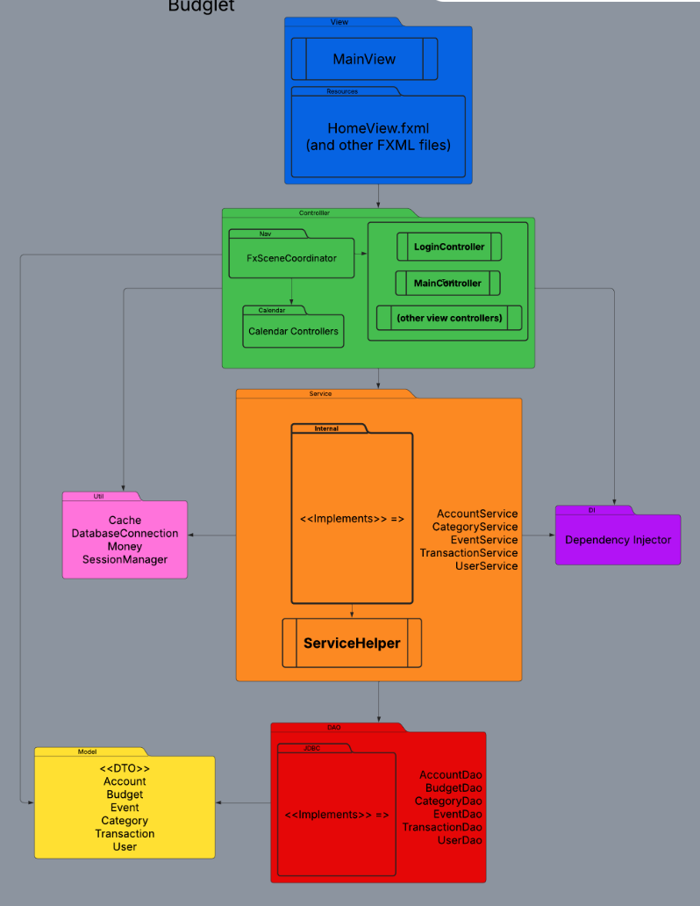

# Architecture Overview

This document provides an overview of the Budglet application architecture. It describes the application's layered design, the responsibilities of each layer, and how data flows throughout the system. 

Budglet was developed using a layered Model-View-Controller (MVC) architecture with a Service layer, Data Access Objects (DAOs), and Dependency Injection. This design separates the user interface, business logic, and database operations, making the application easier to maintain and extend. 

## Table of Contents

- [System Architecture](#system-architecture)
- [Architectural Pattern](#architectural-pattern)
- [Application Layers](#application-layers)
- [Data Flow](#data-flow)
- [Technologies Used](#technologies-used)
- [Design Decisions](#design-decisions)

## System Architecture

The following diagram illustrates the overall architecture of the Budglet application.

The application is organized into several independent layers that communicate with one another. User interactions begin in the View layer and pass through Controllers and Services before reaching the database. Data returned from the database following the same path in reverse until it is displayed to the user. 

## Architectural Pattern

Budglet follows the Model-View Controller (MVC) architectural pattern. 

The MVC pattern separates the application into independent components, each with a specific responsibility:

- **Model** stores application data.
- **View** displays information to the user.
- **Controller** processes user interactions. 
- **Service** contains business logic.
- **DAO** communicates with the database. 

Separating these responsibilities improves code organization, simplifies maintenance, and makes future development easier. 

## Application Layers

### View Layer

The View layer contains the JavaFX user interface and FXML that define the application's screens. 

Its responsibilities include: 

- Displaying application data
- Collecting user input
- Presenting charts, reports, and financial information
- Forwarding user actions to the appropriate controller

The View Layer does not directly communicate with the database. 

### Controller Layer

Controller receive events generated by the user interface. 

Their responsibilities include:

- Handling button clicks and user actions 
- Validating user input 
- Calling Service classes
- Updating the user interface with returned data

Controller coordinate application behavior but contain very little business logic. 

### Service Layer

The Service layer contains the application's business logic.

Responsibilities include:

- Processing financial calculations
- Managing budgeting rules
- Validating business operations
- Coordinating communication between Controllers and DAOs

This layer keeps business rules separate from both the user interface and database implementation. 

### Data Access Layer (DAO)

The Data Access Object (DAO) layer is responsible for data communication. 

Responsibilities include:

- Executing SQL queries 
- Creating, reading, updating, and deleting records
- Mapping database records to application objects
- Managing persistent application data

Separating database access into DAOs improves maintainability and reduces coupling between components.

### Model Layer

The Model layer represents the application's data. 

Example include:

- User
- Budget
- Account
- Transaction
- Category
- Event 

These objects are passed throughout the application without containing user interface logic.

## Data Flow 

A typical request follows this sequence:

1. A user interacts with the JavaFX interface. 
2. The View forwards the action to the appropriate Controller.
3. The Controller validates the request and calls the appropriate Service. 
4. The Service performs business logic and requests data from a DAO. 
5. The DAO executes SQL queries against the PostgreSQL database. 
6. The requested data is returned through the Service.
7. The Controller updates the View with the returned information.

This layered approach keeps each component focused on a single responsibility.

## Technologies Used

Budglet was developed using the following technologies:

- Java
- JavaFX
- FXML
- PostgreSQL
- Maven
- JDBC
- Git
- GitHub

### Design Decisions

Several architectural decisions were made to improve the organization and maintainability of the application.

### Model-View-Controller (MVC)

MVC separates the user interface from business logic and data, making each component easier to understand and modify independently.

### Service Layer

Business logic is isolated within Service classes rather than Controller or database code. 

### Data Access Objects (DAO)

Database operations are isolated within DAO classes, allowing SQL logic to remain separate from application logic. 

### Dependency Injection 

Dependency injection provides controllers with access to the services they require while reducing coupling between components. 

### Layered Architecture

Using independent layers improves readability, testing, maintainability, and future scalability by assigning each component a clearly defined responsibility.

## Next Steps 

For additional technical documentation, refer to:

- [Database Documentation](DATABASE.md)
- [Testing Guide](TESTING.md)
- [Troubleshooting Guide](TROUBLESHOOTING.md)