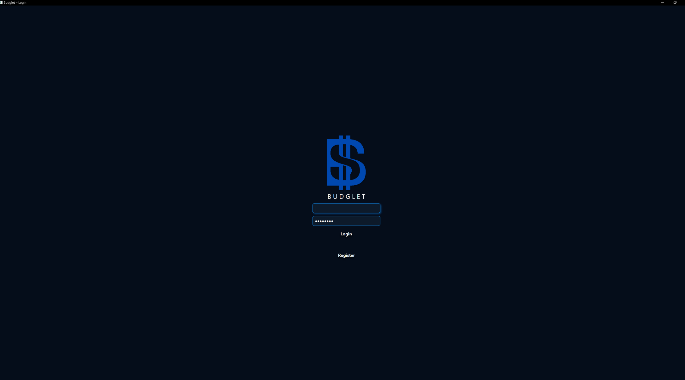
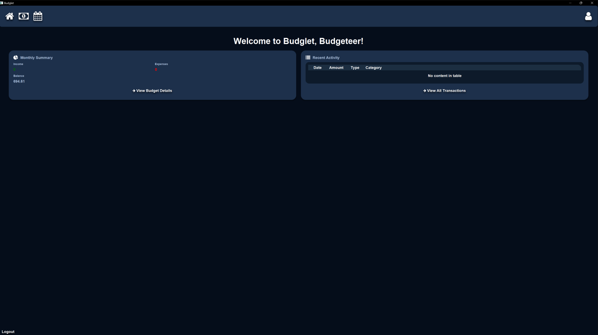
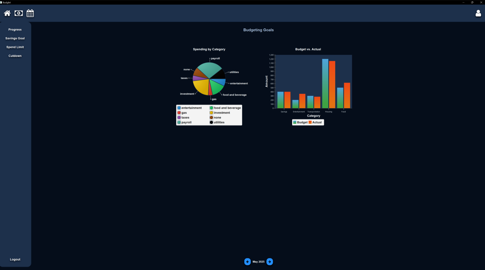
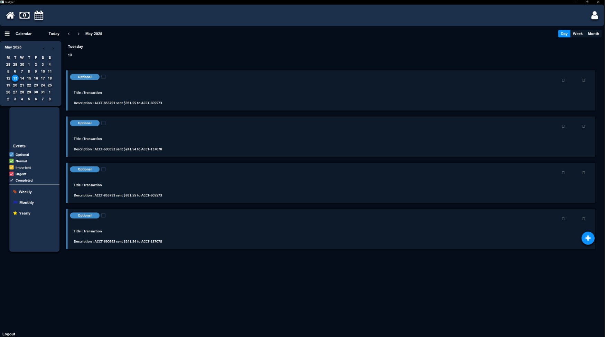
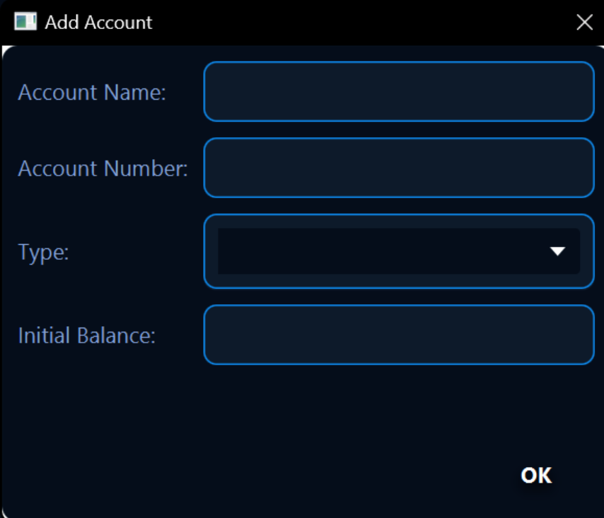

# Budglet-Documentation

Technical documentation portfolio for the Budglet, a Java-based personnal finance application. This pository contains technical documentation created for Budglet, a personnal finance application developed as a team project for a senior-level Software Engineering course at California State University San Marcos.

## Project Overview

Budglet is a desktop application designed to help users manage their personal finances by tracking income, expenses, bugets, and financial goals.

## Screenshots

### Login Screen

### Home Dashboard

### Budgeting

### Calendar

### Profile

## Technologies
- Java
- JavaFX
- PostgressSQL
- Maven
- CSS

## My Contributions
My responsibilites on the project included:
- Quality assurance testing
- Creating and validating mock transaction data
- SQL testing and data validation
- Team Collabration during development
- Contributing to project documentation

This repository expands upon that work by showcasing documentation created for technical writing portfolio purposes. 

## Documentation Included

- [Installation Guide](INSTALL.md)
- [User Guide](USER_GUIDE.md)
- [Architecture Overview](ARCHITECTURE.md)
- [Database Documentation](DATABASE.md)
- [Testing Guide](TESTING.md)
- [Troubleshooting Guide](TROUBLESHOOTING.md)

## Acknowledgments

Budglet was developed as a team project for a senior-lefvel Software Engineering course at Califorina State University San Marcos. This repository focuses on documentation that I created for portfolio purposes.
