# System Design

## Overview

This document describes the overall design of Budglet. It explains the application's architecture, major user workflows, object relationships, and implementation details using UML diagrams, sequence diagrams, class diagrams, and selected source code examples.

Budglet was designed using a layered Model-View-Controller (MVC) architecture with JavaFX, Service classes, Data Access Objects (DAOs), and PostgreSQL. This design separates the user interface, business logic, and data access into independent components, improving maintainability and scalability. 

## Table of Contents

- [System Design](#system-design)
  - [Overview](#overview)
  - [Table of Contents](#table-of-contents)
  - [System Overview](#system-overview)
  - [Application Workflow](#application-workflow)
  - [User Registration](#user-registration)
  - [User login](#user-login)
  - [Account Management](#account-management)
  - [Transaction Processing](#transaction-processing)
  - [Budget Management](#budget-management)
  - [Financial Tracking](#financial-tracking)
  - [Code Examples](#code-examples)
    - [MainController](#maincontroller)
    - [SessionManager](#sessionmanager)
    - [AccountDAO](#accountdao)
    - [JavaFX Layout](#javafx-layout)
  - [Design Principles](#design-principles)
    - [Separation of Concerns](#separation-of-concerns)
    - [Model-View-Controller (MVC)](#model-view-controller-mvc)
    - [Model-View-Controller (MVC)](#model-view-controller-mvc-1)
    - [Data Access Objects (DAO)](#data-access-objects-dao)
    - [Reusability](#reusability)
    - [Maintainability](#maintainability)
  - [Technologies Used use](#technologies-used-use)
  - [Next Steps](#next-steps)

## System Overview

The following use case diagram illustrates the primary features available to Budglet users. 

The application allows user to:

- Register and authenticate accounts
- Link financial accounts
- Record income and expenses
- Create budgets
- Manage savings goals
- Track spending
- View financial reports and charts

These features work together to provide users with a centralized personal finance management application. 

## Application Workflow

Budglet follows a layered workflow. 

A typical request passes through the following components:

1. User interacts with the JavaFX interface.
2. The View forwards the request to a Controller.
3. The Controller validates user input. 
4. Business logic is executed by a Service. 
5. The Service communicates with a DAO.
6. The DAO executes SQL queries against PostgreSQL.
7. Results are returned back through the Controller to the View.

This layered design separates responsibilities and reduces coupling between application components. 

## User Registration 

The following sequence diagram illustrates the registration process. 

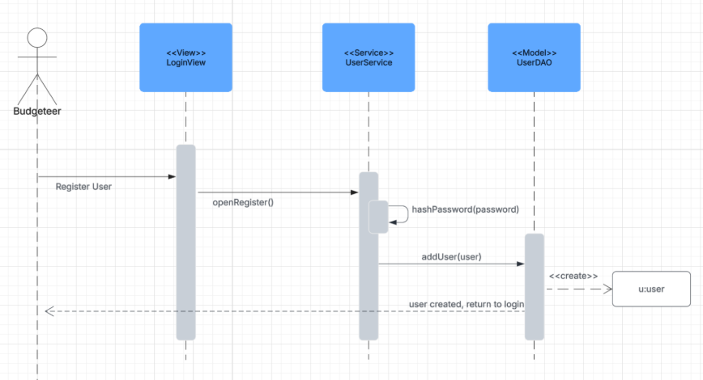

During registration:

- The user enters registration information. 
- Passwords are securely processed. 
- User information is stored in the database.
- The application redirects the user to the login screen after successful registration.

The structural design below illustrates the interaction between controllers and data access objects during user registration. 

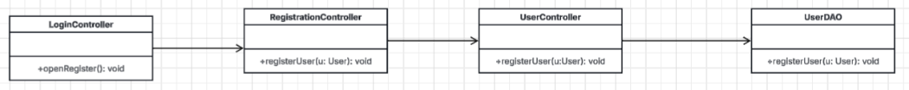

## User login

The following sequence diagram illustrates the login process. 

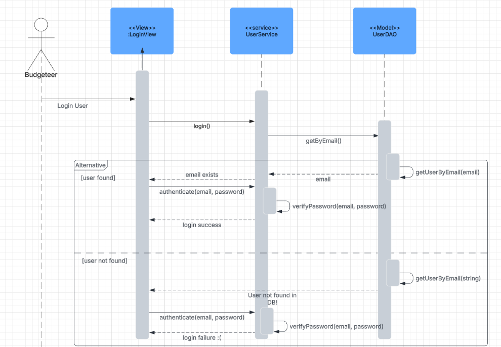

Authentication follows these steps:

- User submits credentials. 
- The application retrieves the matching accounts.
- Passwords are verified.
- Successful authentication redirects the user into the application.
- Invalid credentials generate an authentication error.

The structural diagram below illustrates the classes involved during login. 

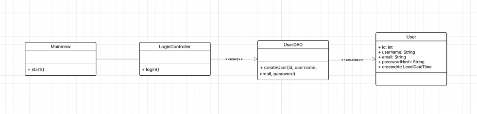

## Account Management

Users can link financial accounts after logging in.

The following sequence diagram illustrates the account-linking process.

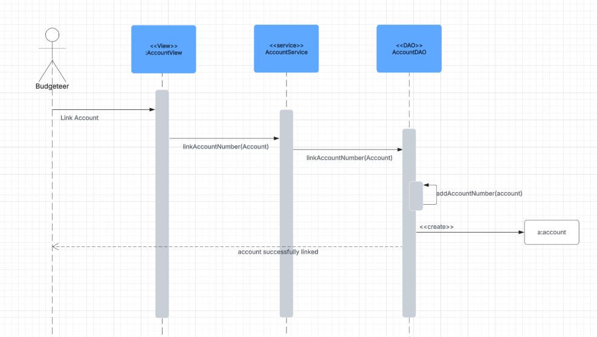

The structural diagram below shows the interaction between the Account Controller, View, and DAO.

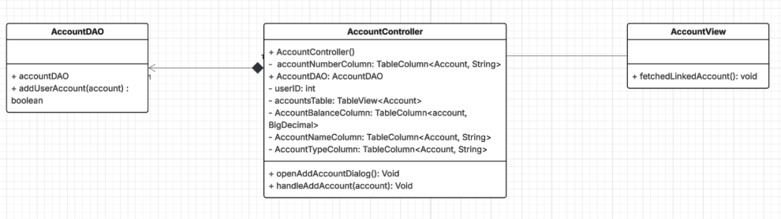

## Transaction Processing

Transactions are processed through multiple application layers. 

The sequence diagram below illustrates transaction processing.

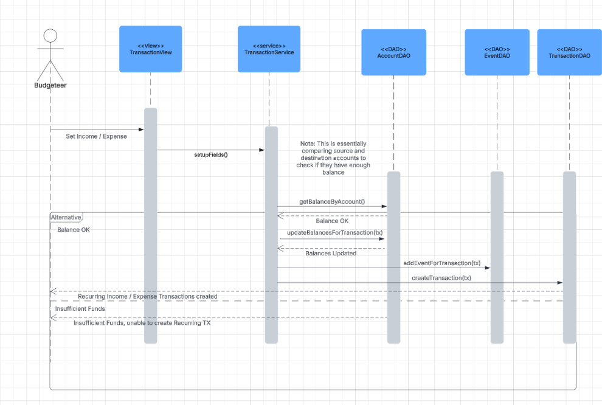

Before recording a transaction, the application validates available balance and updates account information.

Recurring transactions and calendar events are created when appropriate. 

## Budget Management

Budglet supports multiple budgeting features including:

- Saving goals
- Spending limits
- Budget countdowns

The following sequence diagram illustrates budget creation. 

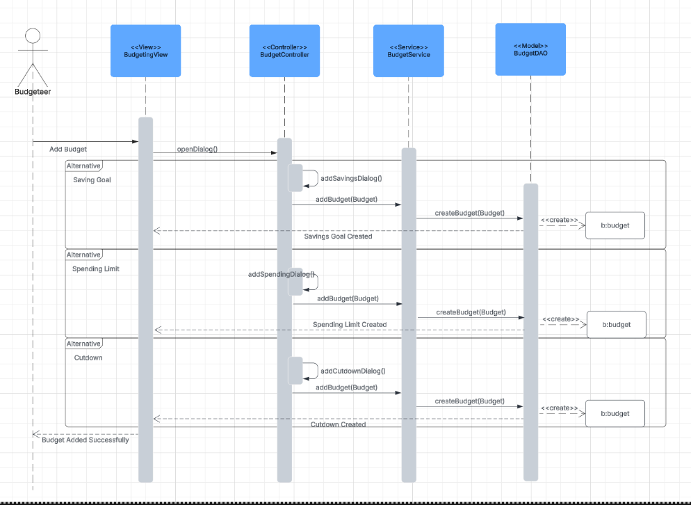

The class diagram below shows the relationships between budgeting components.

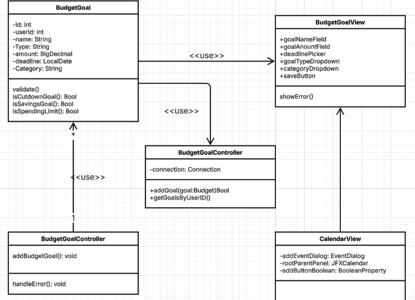

## Financial Tracking

Budglet generates reports using transaction and budgeting information. 

The sequence diagram below illustrates how financial information is collected for reporting. 

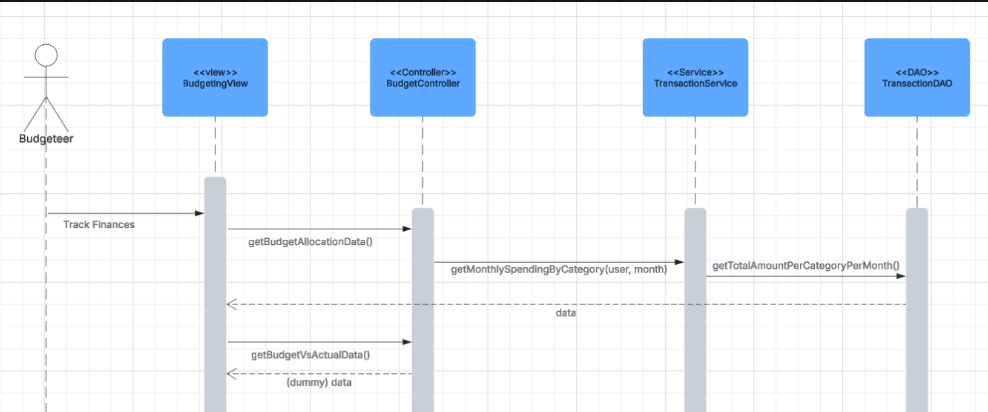

Financial summaries displayed on the Home Dashboard are generated using budgeting and transaction data. 

## Code Examples

The following source code snippets illustrate several implementation details used throughout Budglet.

### MainController

The MainController manages navigation between major application views while loading JavaFX interfaces. 

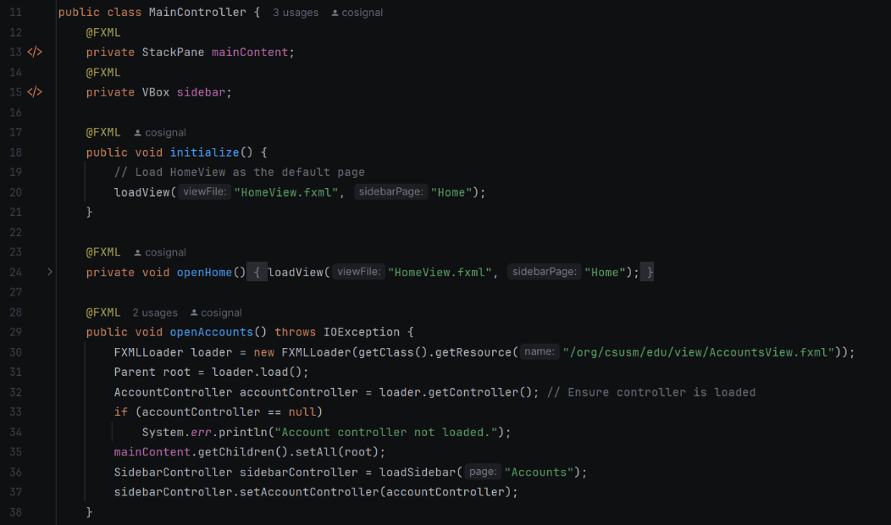

### SessionManager

The SessionManager maintains information about the currently authenticated user throughout the application. 

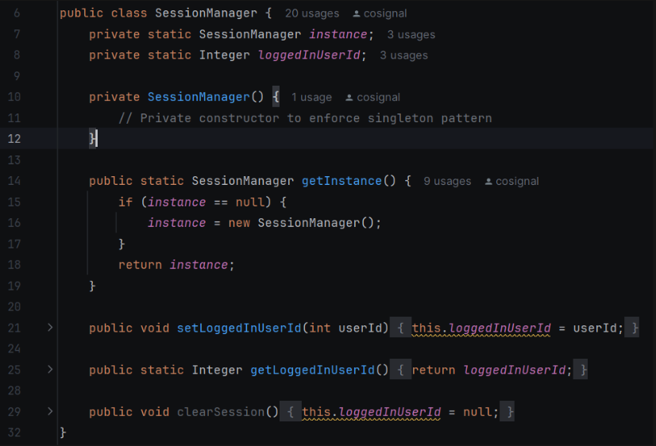

### AccountDAO

The Account DAO provides database access for retrieving account information using SQL queries.

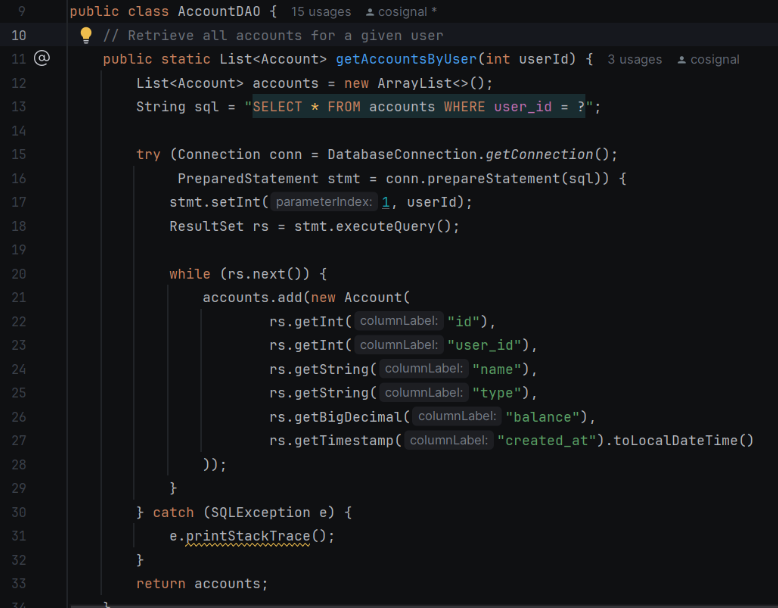

### JavaFX Layout

Budglet uses FXML files to define the application's user interface.

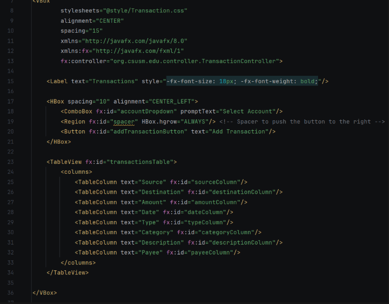

## Design Principles

Several software engineering principles guided the design of Budglet.

### Separation of Concerns 

Business logic, user interface code, and database operation are separated into independent layers. 

### Model-View-Controller (MVC)

MVC isolates presentation logic from application behavior and data management. 

### Model-View-Controller (MVC)

MVC isolates presentation logic from application behavior and data management. 

### Data Access Objects (DAO)

Database communication is centralized within DAO classes. 

### Reusability

Controllers and services are organized to promote reusable application components.

### Maintainability

The layered architecture allows new features to be added while minimizing changes to existing code. 

## Technologies Used use

Budglet was developed using:

- Java
- JavaFX
- FXML
- PostgreSQL
- JDBC
- Maven
- Git
- GitHub

## Next Steps 

For additional technical documentation, refer to:

- [Database Documentation](DATABASE.md)
- [Testing Guide](TESTING.md)
- [Troubleshooting Guide](TROUBLESHOOTING,md)
